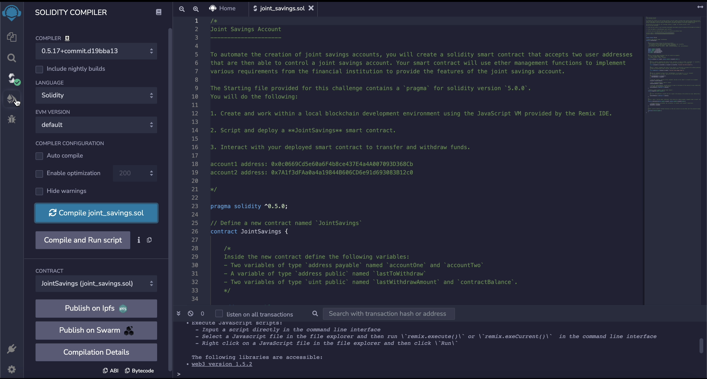
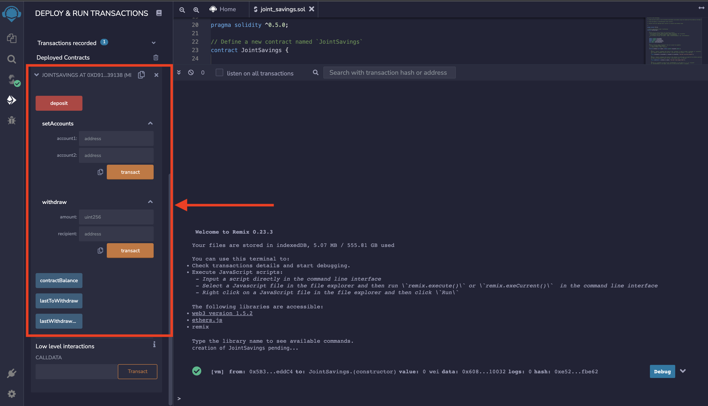
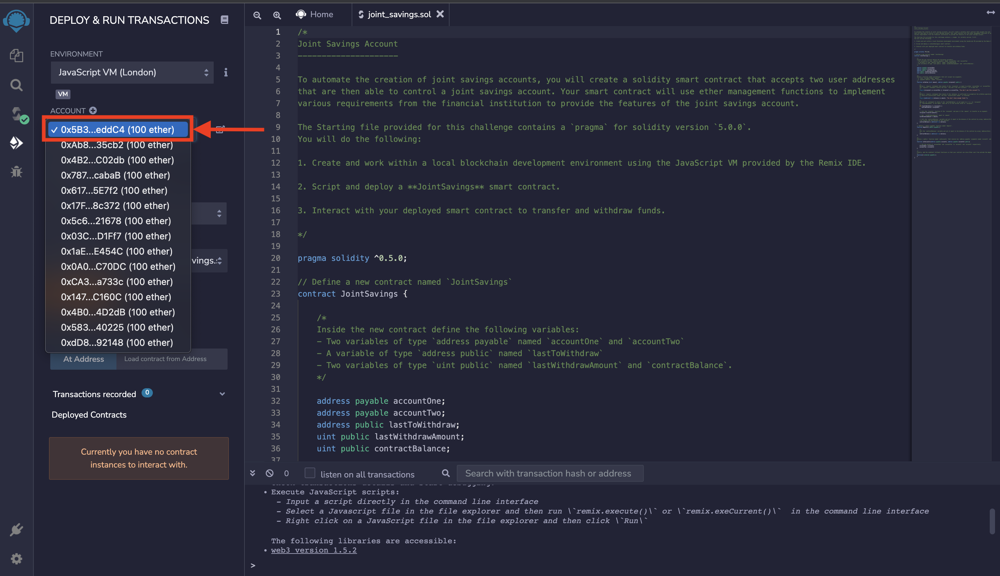
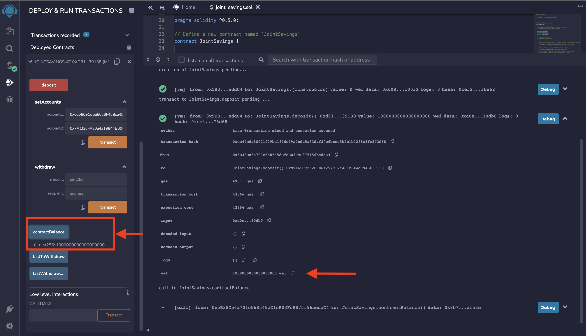
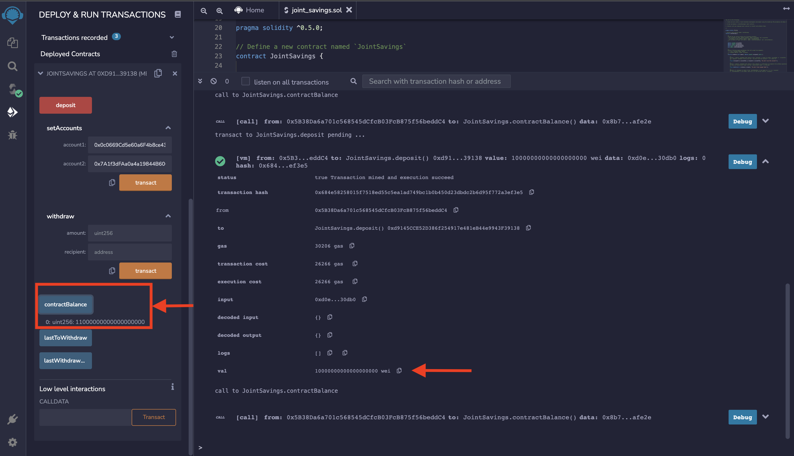
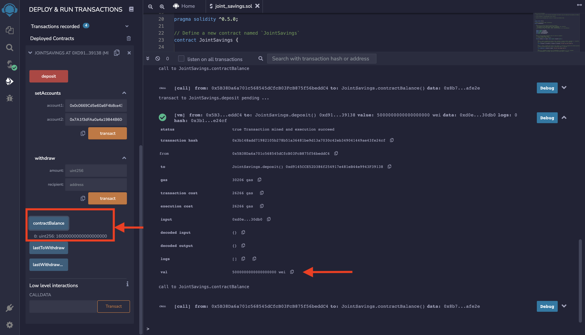
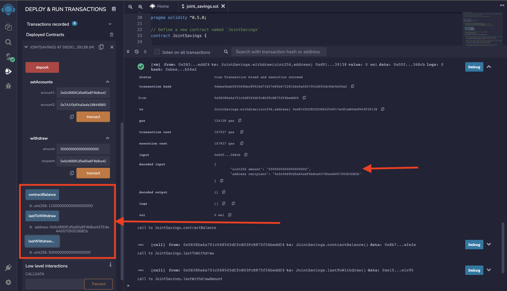
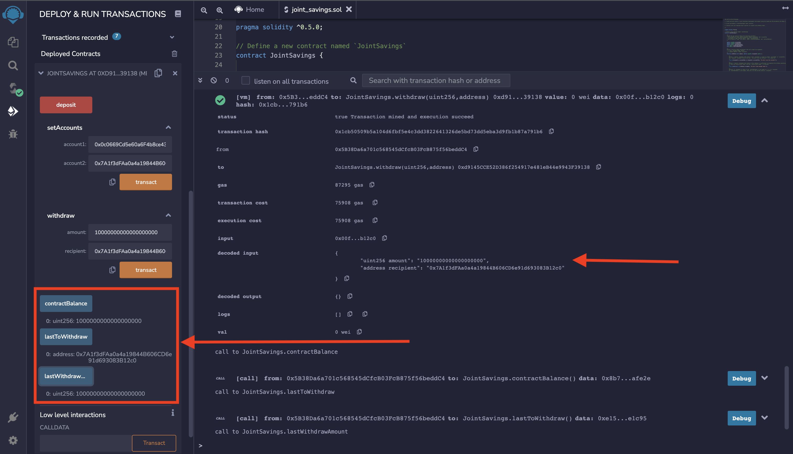

# Joint Savings Account

This is a smart contract application that allows to emulate the features, processes and functionality between different financial accounts, such as hosting joint savings accounts. 
For demonstration purposes and to automate the creation of joint savings accounts, it has been created a Solidity smart contract that accepts two user addresses. These addresses are able to control a joint savings account. The smart contract uses ether management functions to implement a financial institution’s requirements for providing the features of these accounts. These features consists of the ability to deposit and withdraw funds from the account.
 
 
In the following steps, it is explained with an example how the smart contract works:

First, the contract is compiled and deployed in the JavaScript VM. 

- In the Remix IDE, navigate to the “Deploy & Run Transactions” pane, and then select “JavaScript VM” as the environment.
- Click in the Deploy button to deploy the smart contract, and then confirm that it is successfully deployed.
 

After the contract is deployed, it’s time to test its functionality, and to interact with the deployed smart contract, the 2 following testing accounts are created:

- account1 address: 0x0c0669Cd5e60a6F4b8ce437E4a4A007093D368Cb
- account2 address: 0x7A1f3dFAa0a4a19844B606CD6e91d693083B12c0
 

To test the deposit functionality of the smart contract, it is sent the following amounts of ether as follows:

- Transaction 1: Send 1 ether as wei.

- Transaction 2: Send 10 ether as wei.

- Transaction 3: Send 5 ether.
 

After each transaction, it is used the contractBalance function to verify that the funds were added to the contract.

Once it has been successfully deposited the funds into the contract, it is tested the contract’s withdrawal functionality by withdrawing funds from the joint savings account as follows:

- Withdraw 1: 5 ether into accountOne. 

- Withdraw 2: 10 ether into accountTwo. 
 

After each transaction, it is used the contractBalance function to verify that the funds were withdrawn from the contract. Also, it is used the lastToWithdraw and lastWithdrawAmount functions to verify that the address and amount were correct.
 
 

In the next steps, there is a graphical description of the process:
 

1. Once the the smart contract script has been finished, we proceed to compile it.
 

 
 

2. After the compilation, the smart contract is deployed.
 

 
 

3. Verify the account where the deposits come from.
 

 
 

4. The first deposit of 1 ether in wei is completed.
 

 
 

5. The second deposit of 10 ether in wei is completed. The total balance is 11 ETH.
 

 
 

6. The third deposit of 5 ETH is completed. The total balance is 16 ETH.
 

 
 

7. There is a withdraw of 5 ETH from the joint savings account to account One. The total balance is 11 ETH.
 

 
 

8. There is a withdraw of 10 ETH from the joint savings account to account Two. The total balance is 1 ETH.
 

 
 

9. After the 3 initial deposits to the joint savings account and gas fees, the final balance of the testing account is 83.999999999999308034 ETH.
 

