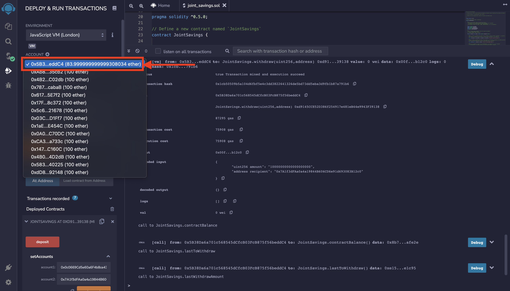

# Joint Savings Account

This is an smart contract application that allows to emulate the features, processes and functionality between different financial accounts, such as hosting joint savings accounts. 
For demonstration purposes and to automate the creation of joint savings accounts, it has been created a Solidity smart contract that accepts two user addresses. These addresses are able to control a joint savings account. The smart contract uses ether management functions to implement a financial institution’s requirements for providing the features of these accounts. These features consists of the ability to deposit and withdraw funds from the account.
 
 
In the following steps, it is explained how the smart contract works:

1. Once the the smart contract script has been finished, we proceed to compile it.
 

 
 

2. After the compilation, the smart contract is deployed.
 

 
 

3. Verify the account where the deposits come from
 

 
 

4. The first deposit of 1 ether in wei is completed
 

 
 

5. The second deposit of 10 ether in wei is completed
 

 
 

6. The third deposit of 5 ETH is completed. The total balance is 16 ETH.
 

 
 

7. There is a withdraw of 5 ETH from the joint savings account to account One.
 

 
 

8. There is a withdraw of 10 ETH from the joint savings account to account Two.
 

 
 

9. After the withdraws, the final balance of the contract is 1 ETH
 

